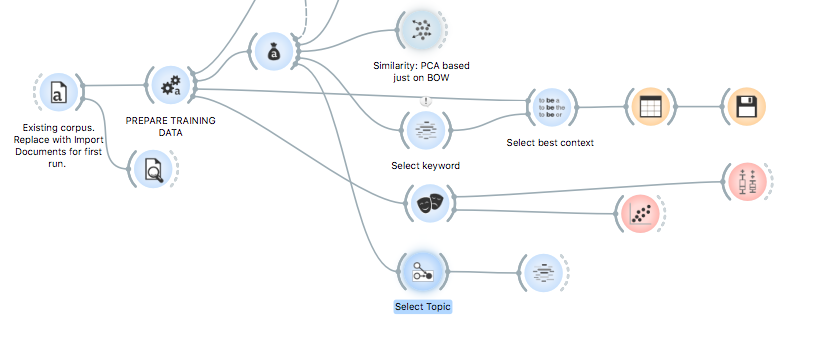
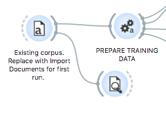
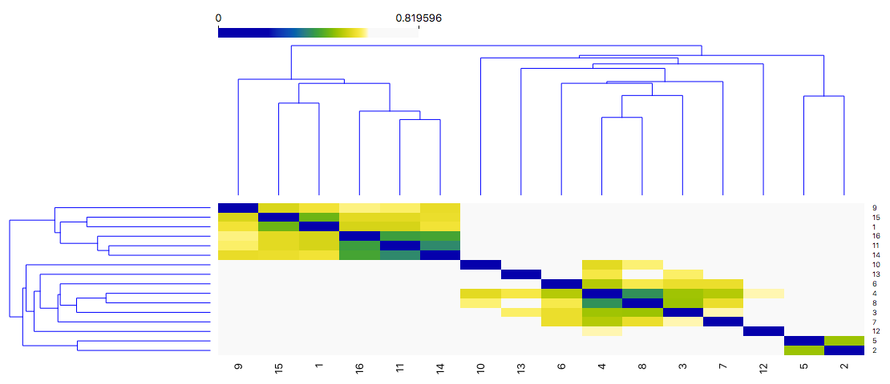
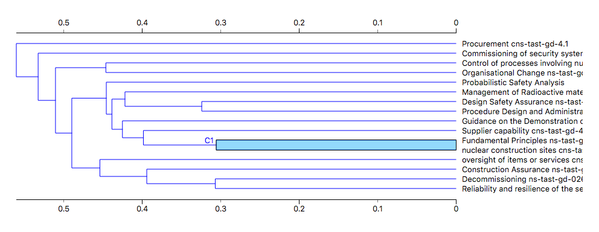

# Selecting, tailoring and deploying a portfolio framework

**[Purpose](#Purpose)** | **[Motivation](#Motivation)** |**[Quick start](#Quick-start)** |

# Status

This directory is being actively rewritten at this time (6/6) Please treat with caution. 

# Purpose

Tune the portfolio management activities so they relate to a particular business or function or set of regulations. 

# Motivation

The idea is to select large project or business function libraries - and use this process to start to make sense of what the key documents and the key themes are - so that the portfolio management tasks are tuned to an understanding of the business area. 

This is better when it either starts from a good portfolio framework (see elsewhere in this repo) and when there are domain experts who can set out out the key themes and relationships. 

But this can be a self-standing exercise, perhaps in a very new or growing area. 

# Quick-start

1. Download or clone Repository

1. Install Orange Datamining from [here](https://orange.biolab.si/download)

1. Open the Orange model in the folder, ending *.ows

1. Install the Network and Text-mining widgets

1. Run the model

1. Check you can replicate the example as described below

1. Now replace the nuclear file pdfs with pdfs, word documents and texts relevant to your business domain

1. Train the model on these new texts

1. Print out the  results of interest to you (topic model / grouping similar documents etc)

# Usage

## Tips for smoother use

1. Enable and Disable links between widgets as needed to avoid excessive recalculation. 

1. Frequent use of 'view table' widget and 'save file' widget aids understanding - but best to add these only when you need them, then remove, to avoid confusing clutter

1. If you have forked the repository, it can be faster to work intensely with the Orange file outside the repository, and then copy it back in once done - since GitHub Desktop takes time to synch the file

1. Once the corpus has been created with Import Corpus, it is quicker going forward to use the Save Widget to save the corpus as a Tab file. Then delete the Import corpus widget and replace it with the Corpus widget, using that to open the tab file. 

# Further explanation of steps if necessary

- pay attention to which links are enabled, and which are disabled, when first opening. enabling links one at a time allows calculation time to be controlled. 

- The first time, use the 'import documents' widget to bring in the Nuclear pdf files

- Subsequently, one can save the corpus with 'Save file' widget. The corpus can be saved as a *.tab file, and then in future the Corpus widget can just refer to this.

- Modify 'Prepare training data' widget if you want other tokenisation options.a good early check is to look at the word cloud and make sure useful words are being tokenised. 

- Bag of words widget can be modified for different model type. One can also refer to a list of stop words (in this folder). Lexicon is an interesting option - if one has been working with an expert and already has a structure in mind.

-I have removed the Kmeans widget followed by the sieve owing to difficulty of interpretation. 

## Adding extra functionality if required

Heat-Map widget can be added to Topic model output. 

# Worked Example

## Topic modelling and Document clustering for a client project library
We machine-read all the different words in each document, and uncovered clusters of similar documents, document outliers, and the main topics covered. 

This should be applied and extended to reading project documents at a client and so understand their whole portfolio. That way one combines a machine-reading view with our own assessment of the client’s business.

## Introduction

One can take any set of project documents and build a topic model to understand how a business fits together. 

Here we have taken regulatory and method documents for running nuclear projects. 

We successfully machine-read all the different words in each document, and uncovered clusters of similar documents, document outliers, and the main topics covered. 

This should be applied and extended to reading project documents at a client and so understand their whole portfolio. That way we are able to combine a machine-reading view with our own assessment of the client’s business.

We have taken a typical client library, in this case documents from the Office of Nuclear regulation which are relevant to how projects should be planned and executed, see [here](http://www.onr.org.uk/operational/tech_asst_guides/index.htm). 

This will help in deciding with a nuclear client which focus areas need most attention, by checking to see whether the client perceptions of the project challenge /opportunity are similar or different to the themes that are covered in their documents. 

We would like to know:

- the main clusters of documentation by content area

- any stand-out documents

- what topics are covered by the library. 

## Main results

- The main clusters of documentation by content area
x
y
z

- stand-out documents: xx

- Dominant topics xx

### Take away for discussion with the Senior team

***CLUSTERS:*** Do document clusters represent what you would expect to find in your documents? Are there any significant areas where you suspect there might not be enough work or projects?

***THEMES:*** Are you comfortable that your projects altogether are appropriately reflecting the importance of the highlighted themes ? 

 

We could explore these themes with the relevant extracts from the respective Watson or Google Knowledge graphs, see below: 

1st is Watson blue mix looking for links between xx and yy, 2nd Google search via Infranodus for links between xx and yy

## Data

This library could be a project library or a process and standards library, or a collection of day to day management communications and reports. Hundreds of documents can be used, I have tested up to 400 with no problems. For this example, I have kept to 16.

| Document                                              | Reference           |
| ----------------------------------------------------- | ------------------- |
| Commissioning of security systems and infrastructure  | cns-tast-gd-4.4     |
| Construction assurance                                | ns-tast-gd-076      |
| Control of processes involving nuclear matter         | ns-tast-gd-023      |
| Decommissioning                                       | ns-tast-gd-026      |
| Design Safety Assurance                               | ns-tast-gd-057.pdf  |
| Fundamental Principles                                | ns-tast-gd-004      |
| Guidance on the Demonstration of ALARP                | ns-tast-gd-005      |
| Management of Radioactive material                    | ns-tast-gd-024      |
| nuclear construction sites                            | cns-tast-gd-6.6.pdf |
| Organisational Change                                 | ns-tast-gd-048      |
| oversight of items or services                        | cns-tast-gd-4.3.pdf |
| Probabilistic Safety Analysis                         | ns-TAST-GD-030      |
| Procedure Design and Administrative Controls          | NS-TAST-GD-060      |
| Procurement                                           | cns-tast-gd-4.1     |
| Reliability and resilience of the security system     | cns-tast-gd-5.1     |
| Supplier capability                                   | cns-tast-gd-4.2     |

## Extract, Transform and Load the data

- Data extracted

The documents were converted into a text format compatible with Orange, and saved as one single libary. These documents are then read in from the file as a document corpus 

Once the documents have been imported, the first widgets can be replaced with something that reads the corpus as a tab file (xx).

- Data transformation and load

sample the data, as many of the early results in this paper have been run with smaller subsets of the 500 documents for speed. 

- Pre-process the data .

The first widget turns all the text into tokens (normally words). 
The next widget turns each document into a “bag of words”, showing how many words are used in each.

Where, required, a lot of work can be done here to improve the way that the documents are tidied up and the words are selected. 

## Document clustering using distances between documents, then representing as a network 

We first compute the distances between each document and every other document, based upon which words are found in which. There are several ways of visualising this data, and I have selected to show the distances as a network. This method allows you to treat documents that are like each other as being nodes connected with an edge, and we can set the distance threshold at which we decide to allocate an edge.  When doing this, we are paying more attention to the clusters rather than to the outliers. 

By starting with clusters that are at a manageable human scale, such as three to six clusters, we can get a sense of the library. Then we can progressively allow the more ambiguous documents to appear and see more complex clusters only when we need it. 

Or we can have focussed in on one area with a manageable number of key documents, and only then start to find our way round the detailed clusters and relationships. This method could also be run on subsets of the data once we have decided which topics or words we are interested in. I.e. We could have selected a topic of interest and then looked in detail at the relevant documents as a network. 

- There appear to be two document clusters:

1 One around construction and security
2 One around decommissioning and nuclear handling. 

- There is one smaller cluster around assurance.

And so on. Once you select a cluster, you can view the documents and respective cloud. 

the same analysis can also be viewed showing finer grained sub-clusters

This is another way of viewing the same information, which could be useful when there are far more documents being reviewed.

The small cluster of assurance can be clearly seen at the bottom. 

## Looking for outliers, and testing our original clusters at the same time

As can be seen above there  also one outlier, which is around Probabilistic safety analysis.  

Let us compare that view with another analysis. 
Using the hashing algorithm, we establish different clusters of documents, based upon word-similarity.

This one suggests that Procurement is an outlier. 
Other than that, it also sees to see as before similar groups

1 One around construction and security (top 3 docs)
2 One around decommissioning and nuclear handling. (bottom 12 docs)

But it also sees sub-clusters, for example the bottom two documents (Decom and Reliability).

This algorithm will scale well up to much large collections, and it also will be useful for the future, when trying to find a cluster of documents that is most relevant to a search document or search paragraph that we have. Once we select a cluster, however big or small, we can then view those documents together, or export them into their own folder.

The first time, it is worth looking at alternate clustering algorithms, to see which perform better, or whether they pick up different aspects of the library.

Here, a multi-dimensional scaling tries to reduce difference to two dimensions, and we see similar outliers.

## Topic modelling

Topic modelling  is another alternative, where the advantage is that topics can overlap each other within one document, whereas the above document clustering doesn’t allow this. 
We can investigate one topic more closely. By selecting Topic xx, we see some detailed areas explored within this topic, and particular documents and sentences could be explored in the same way as for the main document word cloud above, drilling down into the concordance of sentences for each subject of interest. 

Taking the results, and ignoring the first topic, which relates to xx,  the top  topics are:
1
2
3

This is particularly powerful when we start to use broader knowledge graphs available to us. To probe topic xx for example we can compare and combine with the Watson news knowledge graph. From the link page, we can read off each of the nodes on this graph, as well as the key articles. For topic 10, I have sent Google search for xx and yy to output as a graph in Infranodus. Again, we can read create and tailor this knowledge graph. 

## First explorations of themes with the portfolio team

Stepping back to the actual process with the client, there is an advantage in placing in some intermediate analysis before the above. This helps to calibrate and judge expectations, as well as identify themes and pain points, and to get the client starting to work with us to direct the analysis to areas of the library that will shed light on the biggest opportunities and problems.

For example, word cloud can be explored with the client early in the engagement. Words can be selected, and sent forward to be viewed in a concordance, to show how the word is being used within the sentence. The best documents can be selected and sent to be viewed and saved separately. The client is likely to latch onto certain themes worthy of investigation, either because they confirm opinions or because they surprise. There may be work that has been done by the team which the client was not aware of in these key areas. This is also something that can be returned to later, perhaps doing a separate more detailed NLP exercise on the key documents once they have been identified. There are many ways of tailoring the pre-processing of text, loading it with key terms, which allows this to become a focused exercise where required. 

With Sentiment analysis, we can inspect documents in on exceptionally positive or negative sentiment, like this doc xxx

## Motivation 
NLP is one of the fastest growing applications. Orange is only one of many platforms which allows this work to be done. What we are doing here, we can do on a whole number of tools and platforms. One can use whichever open source or enterprise tool is easiest for the given job, providing the portfolio team focusses on understanding the principles. These example workflows can quickly be moved across to the best tool.

## How could this be improved ?
 
xx call CSV

### How to run in a conda environment

You don't need to do this if you have installed and opened Orange as a standalone application. 

- Install conda
- Install orange with conda
- 	conda activate orange3c
	orange-canvas
- Open Ows file through Orange window
- disable links between widgets to avoid auto calculation
- Either start from the Corpus file, or read in the documents again
 

### Installation On Older Mac:

create python 3.7.6 environment
conda install orange3 orange3-network orange3-text
pip install PyQt5 PyQtWebEngine 
